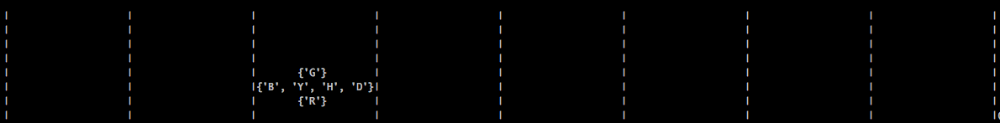

==================================================
``Py-knights-arena``: One more py-game of knights
==================================================

.. image:: https://img.shields.io/badge/coverage-97%25-brightgreen.svg
    :target: #

Requirement Specification
=========================

Apart from the requirements provided in the challenge a further clarification is required. The knights of this game
are **daring vs clever** and **humble vs murderous**. This distinction is needed to resolve the following use cases:

1.  In a two knights encounter, if any of the two is unarmed then a truce will be proclaimed in a live-and-fight
    another day fashion. Nonetheless they are knights and honor is about anything else :). They behave magnanimously
    in such case scenario.
2.  On the other hand if a knight moves into a cell where there are another knight and couple of items, the attacking
    knight will immediately fight if he posses an item. The defender knight would have picked the best weapon in an
    earlier move however the attacker is blind by his eager for the battlefield.

The idea is to simplify the such use cases using a YAGNI reasoning.

Overall Strategy
================
Following the requirements specified above to avoid ambiguity, the use case scenarios for the strategy implementation
have been segregated as follows:

1.  A knight could move off the board and then drown
2.  A knight could move into an empty cell where no action is required except updating the position of the knight and
    the item.
3.  A knight could move into an item-only cell. A cell is item-only iff there is an item and either there are no knights
    or if the are, they all are dead. In which case it will pick an item following the requirements provided in the
    exercise.
4.  I none of the above, the knight has moved into a cell with a knight. In such case the attacking and defending knight
    will fight iff they both are provided with an item. Otherwise they will proclaim truce.
5.  For the cases in which there is a knight and an item, the attacking knight **will always ignore the items** if
    the knight is alive.

How to run
===========

Once this repo has been cloned and unzipped, the requirements need to be installed as follows::

    $ pip install -r requirements.txt

and then the script can be run as::

    $ python -m src.run <<settings.yml>> <<moves.txt>> <<results_folder>>

where:

1.  ``<<settings.yml>>``: is the yaml file where the configuration of the board where knights play is provided
2.  ``<<moves.txt>``: is the path the move instructions
3.  ``<<results_folder>>``: folder where the outputs as a result of running the script will be dropped.

**PS:** It is very important that the input files ordered is respected.

There is a ``game_settings`` settings yaml file in **./examples** that contains the exact requirements of the challenge
so no need to create one manually is required. The file looks like as below:

.. code-block:: yaml

        ---

        table:
          rows: 8
          columns: 8
          start: GAME-START
          end: GAME-END

        knights:
          - name: RED
            nickname: R
            attack: 1
            defence: 1
            status: LIVE
            position: 0,0
          - name: BLUE
            nickname: B
            attack: 1
            defence: 1
            status: LIVE
            position: 7,0
          - name: GREEN
            nickname: G
            position: 7,7
            attack: 1
            defence: 1
            status: LIVE
          - name: GREEN
            nickname: G
            position: 7,7
            attack: 1
            defence: 1
            status: LIVE
          - name: YELLOW
            nickname: Y
            position: 0,7
            attack: 1
            defence: 1
            status: LIVE

        items:
          - name: Axe
            nickname: A
            position: 2,2
            attack: 2
            defence: 0
          - name: Dagger
            nickname: D
            position: 2,5
            attack: 1
            defence: 0
          - name: Magic_Staff
            nickname: M
            position: 5,2
            attack: 1
            defence: 1
          - name: Helmet
            nickname: H
            position: 5,5
            attack: 0
            defence: 1

        ...

Outputs
=======
The application will output a ``final_state.json`` file as required by the challenge. The following files are generated
as a result of running the script:

1.  ``board_map_before.txt``: the script dumps the matrix to a txt file for visual recognition of where each cell
    content has.
2.  ``initial_state.json``: following the json format requirements, it too generate a json file with the satus of the
    board before the script is actually run.
3.  ``board_map_after.txt``: same as ``board_map_before.txt`` but after running the script.
4.  ``final_state.json``: same as ``initial_state.json`` with the board as a result of playing the game.

Some notes about the visual mapping:

a)  Although the length of the column are calculated on the fly to maximise the visual space the pretty-print feature
    is very basic. Just enough to help further with **functional testing**.
b)  ``drowned`` knights are not shown on the visual matrix as they are off the arena. However they do in the JSON file
    as required.
c)  ``dead`` knights are still shown in uppercase in their corresponding cells. The json file reflects the status as
    required.
d)  When a knight picks an item, the item is not shown on that cell on the visual matrix. It does as required in the
    JSON file.

Below samples of the visual matrix before and after running the script as well as the json files:

*Visual Matrix  and JSON file before*:

.. code-block:: bash

    |{'R'}|     |     |     |     |     |     |{'Y'}|
    |     |     |     |     |     |     |     |     |
    |     |     |{'A'}|     |     |{'D'}|     |     |
    |     |     |     |     |     |     |     |     |
    |     |     |     |     |     |     |     |     |
    |     |     |{'M'}|     |     |{'H'}|     |     |
    |     |     |     |     |     |     |     |     |
    |{'B'}|     |     |     |     |     |     |{'G'}|

.. code-block:: python

    {
        "red": [[0, 0], "LIVE", null, 1, 1],
        "blue": [[7, 0], "LIVE", null, 1, 1],
        "green": [[7, 7], "LIVE", null, 1, 1],
        "yellow": [[0, 7], "LIVE", null, 1, 1],
        "axe": [[2, 2], false],
        "dagger": [[2, 5], false],
        "magic_staff": [[5, 2], false],
        "helmet": [[5, 5], false]
    }

*Visual Matrix and JSON file after*:

.. code-block:: python

    {
        "red": [[6, 2], "LIVE", "Axe", 3, 1],
        "blue": [[5, 2], "DEAD", null, 0, 0],
        "green": [[4, 2], "LIVE", "Magic_Staff", 2, 2],
        "yellow": [[5, 2], "DEAD", null, 0, 0],
        "axe": [[6, 2], true], "dagger": [[5, 2], false],
        "magic_staff": [[4, 2], true],
        "helmet": [[5, 2], false]
    }